<div align="center">

# 🛡️ Aegis Financial
### Next-Gen AI Financial Intelligence Platform

[](https://nextjs.org/)
[](https://fastapi.tiangolo.com/)
[](https://www.python.org/)
[](https://tailwindcss.com/)
[](https://www.tensorflow.org/)

<p align="center">
  <b>Credit Risk Assessment</b> • <b>Stock Market Prediction</b> • <b>Advanced Option Pricing</b>
</p>

</div>

---

## 🌟 Overview

**Aegis Financial** is a production-grade fintech dashboard that unifies three powerful financial modeling domains into a single, immersive experience. Built with a **"Soft-Edge" Futuristic Design**, it combines the raw power of machine learning with the elegance of modern UI/UX.

> **Designed for Analysts, Built for Performance.** 
> Seamlessly switch between assessing borrower capability, forecasting market trends, and pricing complex derivatives.

---

## 🚀 Key Features

### 🏦 Credit Risk Engine
*   **Smart Scoring**: Instant borrower evaluation using Random Forest & XGBoost.
*   **Visual Risk Shield**: Intuitive `Low Risk` / `High Risk` indicators with color-coded feedback.
*   **Visual Logic**: "Shield" based risk indicators (Low Risk / High Risk).
*   **Tech**: Scikit-Learn pipelines running on FastAPI.

### 🎥 Demo
[](https://www.youtube.com/watch?v=YOUR_VIDEO_ID_HERE)
> *Watch the full walkthrough on YouTube.*

### 📈 Stock Prediction Lab
*   **Deep Learning**: Bidirectional LSTM networks with Attention mechanisms.
*   **Resilient Core**: Features a **"Smart Fallback"** engine that automatically degrades to a simulation mode if TensorFlow is missing or incompatible.
*   **Interactive Charts**: Gradient-filled Recharts offering deep historical insight.

### 🧮 Option Pricing Suite
*   **Multi-Model Valuation**: 
    *   **Black-Scholes**: For European options.
    *   **Monte Carlo**: For path-dependent simulations.
    *   **Binomial Trees**: For American option exercise strategies.
*   **Live Greeks**: Real-time calculation of Delta, Gamma, Theta, and Vega.

---

## 🏗️ Architecture

```mermaid
graph TD
    User[👤 User] --> FE[🖥️ Next.js Frontend]
    FE --> API[🛡️ FastAPI Backend]
    
    subgraph Services
    API --> Credit[💳 Credit Service]
    API --> Stock[📉 Stock Service]
    API --> Option[📊 Option Service]
    end
    
    Stock --> TF[🧠 TensorFlow / Mock]
    Credit --> SK[🤖 Scikit-Learn]
    Option --> Math[➗ NumPy/SciPy]
```



---

## ⚡ Quick Start

### Prerequisites
*   **Node.js** 18+
*   **Python** 3.10+ (Recommended)

### 1️⃣ Backend Setup
```bash
cd production_platform/backend

# Create virtual environment
python -m venv venv
.\venv\Scripts\activate   # Windows
# source venv/bin/activate # Mac/Linux

# Install dependencies
pip install -r requirements.txt

# Launch Server (http://localhost:8000)
python -m app.main
```

### 2️⃣ Frontend Setup
```bash
cd production_platform/frontend

# Install dependencies
npm install

# Launch Dashboard (http://localhost:3000)
npm run dev
```

---

## 🎨 Design Philosophy
*   **Glassmorphism**: Translucent cards and floating navigation.
*   **Motion**: Framer Motion for fluid, physics-based transitions.
*   **Typography**: Inter font for clean, strictly professional readability.

---

## � License
Proprietary software developed for **Aegis Financial**.
